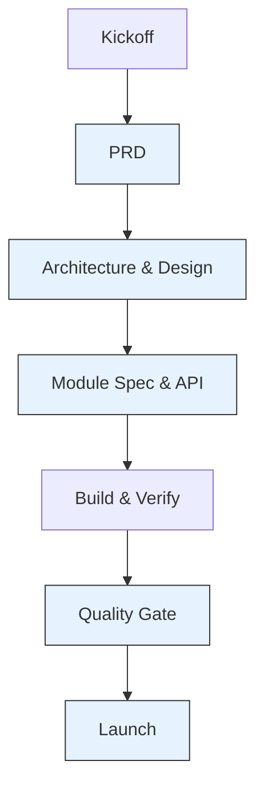
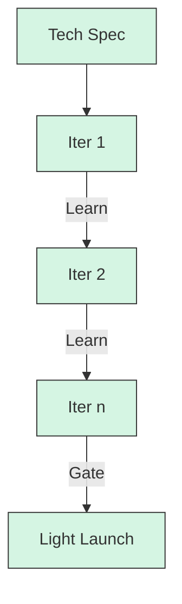
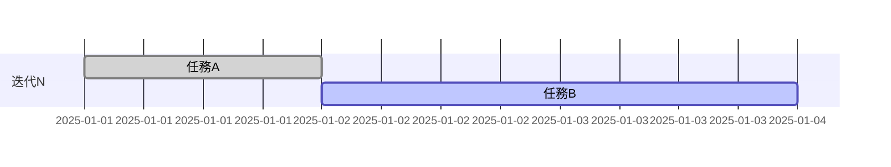

# 產品開發流程使用說明書 (Dual-Mode: Full Process / Lean MVP)

---

**文件版本 (Document Version):** `v2.0`
**最後更新 (Last Updated):** `YYYY-MM-DD`
**主要作者 (Lead Author):** `[VibeCoding AI]`
**狀態 (Status):** `活躍 (Active)`

---

## 目錄 (Table of Contents)

- [1. 使用原則](#1-使用原則適用於兩種模式)
- [2. 模式選擇建議與升級規則](#2-模式選擇建議與升級規則)
- [3. 模式 A：完整流程 (Full Process)](#3-模式-a完整流程-full-process)
- [4. 模式 B：MVP 快速迭代 (Lean)](#4-模式-b-mvp-快速迭代-lean)
- [5. 文檔產出清單與模板映射](#5-文檔產出清單與模板映射)
- [6. Gate 準入/準出與度量](#6-gate-準入準出與度量兩種模式通用)
- [7. 附錄：檢查清單（摘錄）](#7-附錄檢查清單摘錄)
- [8. MVP 產出與格式規範](#8-mvp-產出與格式規範對齊-mvp_tech_specmd-與-development_progress_reportmd)

---

## 1. 使用原則（適用於兩種模式）

- **以文檔為契約**：所有決策以文檔為單一事實來源（SSOT）。
- **小步快跑、可回溯**：優先小批量交付，保留 ADR 以利回溯決策脈絡。
- **風險前置、代價後置**：在投入大量開發前，用審查 Gate 降低重大偏差風險。
- **模式可升降級**：MVP 模式可在風險上升/範圍擴大時升級為完整流程；完整流程在低風險子專案可降級為 MVP。

**角色縮寫（RACI）：**
- PM（產品經理）、TL（技術負責人）、ARCH（架構師）、DEV、QA、SRE、SEC（安全/隱私）、OPS、DATA

**模板路徑：**
- `VibeCoding_Workflow_Templates/00_development_workflow_cookbook.md`
- `VibeCoding_Workflow_Templates/01_project_brief_and_prd.md`
- `VibeCoding_Workflow_Templates/02_bdd_scenarios_guide.md`
- `VibeCoding_Workflow_Templates/03_architecture_and_design_document.md`
- `VibeCoding_Workflow_Templates/04_module_specification_and_tests.md`
- `VibeCoding_Workflow_Templates/05_security_and_readiness_checklists.md`
- `VibeCoding_Workflow_Templates/06_project_structure_guide.md`
- `VibeCoding_Workflow_Templates/01_adr_template.md` (附屬)
- `VibeCoding_Workflow_Templates/04_api_design_specification_template.md` (附屬)

---

## 2. 模式選擇建議與升級規則

- 建議使用完整流程若：涉及金流/法遵/隱私資料、高可用與規模化要求、跨 3+ 團隊協作、需長期維運。
- 建議使用 MVP 若：需快速驗證價值假設、時間/預算有限、功能邊界清晰、可容忍較高風險與手動運維。
- 升級準則（MVP -> 完整）：任一事件觸發升級：
  - 觸及敏感資料或外部合規約束
  - 月活/交易量預估超過既有閾值（例如 DAU > 10k 或 TPS > 100）
  - 引入新服務/資料庫/對外 API 或多團隊協作
  - 產品定位由探索性轉為核心營收/關鍵運營

---

## 3. 模式 A：完整流程（Full Process）

### A0 啟動與對齊（Kickoff）
- 目標：對齊商業目標、成功指標、邊界與風險；建立規範與節奏。
- 輸入：商業構想、既有研究、競品分析
- 產出：
  - 啟動簡報、里程碑與資源規劃
  - 文檔規範與模板鏈接、版本策略
- RACI：PM R、TL/ARCH A、各團隊 C/I
- Gate（準出）：利益相關者對里程碑/風險/溝通節奏達成共識

### A1 構想與規劃（PRD）
- 目標：定義問題、受眾、範圍、成功指標與里程碑
- 輸入：Kickoff 輸出、商業策略
- 產出：`01_project_brief_and_prd.md`
- 主要活動：價值主張、需求分解、KPI、風險與依賴
- RACI：PM R/A、TL/ARCH/QA/OPS/SRE/SEC/DATA C、DEV I
- Gate：PRD 已審核簽核；KPI 可量測且與業務對齊

### A2 高層次架構（SA + ADR）
- 目標：確立系統邊界、架構模式、技術選型、NFR；記錄關鍵決策
- 輸入：PRD、現況系統/資源盤點
- 產出：
  - `03_architecture_and_design_document.md`
  - `01_adr_template.md`（多份，隨決策累積）
- 主要活動：上下文/組件/部署與資料架構、設計權衡、關鍵用戶旅程
- RACI：ARCH R/A、TL R、PM/SRE/SEC/OPS C、DEV/QA I
- Gate：核心 ADR 齊備且權衡明確；NFR 可被驗證；風險與緩解策略明列

### A3 詳細設計（SDD + API）
- 目標：把 SA 轉化為可實作規格與契約
- 輸入：SA、ADR、資料字典
- 產出：
  - `04_module_specification_and_tests.md`
  - `04_api_design_specification_template.md`
  - `06_project_structure_guide.md`
- 主要活動：資料模型與索引策略、內外部介面、流程圖、錯誤與可觀測性方案
- RACI：TL R/A、DEV/ARCH R、QA/SRE/SEC C、PM I
- Gate：介面契約穩定、測試策略完整、回滾與相容性考量完備

### A4 開發與驗證（Build & Verify）
- 目標：可交付、可測試、可回滾的增量交付
- 輸入：SDD、API Spec、Backlog
- 產出：程式碼、測試、建置產物、變更紀錄
- 主要活動：CI/CD、單元/整合/E2E 測試、性能預檢、資安依賴掃描
- RACI：DEV R、TL/QA A、SRE/SEC/OPS C、PM I
- Gate：測試綠燈、Coverage 達標、性能/資安閾值過關

### A5 安全與上線審查 (Quality Gate)
- 目標：在上線前消除高風險弱點、隱私風險並確保生產就緒。
- 輸入：SA/SDD/API、風險登記、掃描報告
- 產出：`05_security_and_readiness_checklists.md`（完成的審查清單與整改項）
- RACI：SEC/SRE R/A、TL/DEV C、PM I
- Gate：高/中風險已整改或有替代方案；威脅模型、資料保護與可觀測性措施完備。

### A6 上線 (Launch)
- 目標：確保可靠性、可觀測性、運維準備就緒
- 輸入：運維手冊、監控儀表板、回滾計畫、災難演練結果
- 產出：Go/No-Go 簽核
- RACI：SRE/OPS R/A、TL/DEV/QA/SEC C、PM I
- Gate：SLO/Alert 就緒；回滾與備援演練通過；Go/No-Go 簽核

### A* 跨階段：變更管理與文件治理
- 變更需更新 ADR 與相依文檔；重大變更需重過 Gate。
- 文檔版本策略：語義化版本 + 變更日誌；關聯 PR/Issue。



---

## 4. 模式 B：MVP 快速迭代（Lean）

### B0 Sprint 0：範圍界定與 Tech Spec
- 目標：最小可行閉環、最快驗證路徑
- 輸入：商業假設、用戶洞察、限制條件
- 產出：一份輕量 `Tech Spec`（合併 PRD/SA/SDD/API 的最小集合）
- 主要內容：
  - 問題/目標用戶/成功指標（最多 3 條）
  - 高層設計一句話 + 1 張組件圖
  - 必要 API 契約（僅核心端點）
  - 1-2 張資料表 Schema
  - 風險與手動替代方案（Runbook 級）
- RACI：PM/TL R/A、DEV/QA/SRE C、其餘 I
- Gate：Tech Spec 被團隊認可；估算與時程可落地

### B1-Bn 迭代循環
- 每次迭代固定交付：可運行版本 + 指標驗證 + 回顧
- 迭代內活動：
  - 設計/實作/測試同步進行；必要時補充簡短 ADR
  - 最低限度安全檢查（Secrets、認證、輸入驗證）
  - 最低限度可觀測性（日誌、基本健康檢查）
- Gate：
  - 端到端用戶路徑可跑通
  - Bug/風險在可接受閾值內
  - 指標達成或產生明確學習（可迭代調整）

### Bx MVP 上線 Gate
- 條件：
  - 有最小可運營 Runbook（部署、監控、回滾步驟）
  - 數據備份已啟用；關鍵日誌可查
  - 風險與債務列入後續 Backlog 與升級評估



升級提示：出現「敏感資料/規模擴大/跨團隊/合規」任一情形，即刻評估升級至「完整流程」。

---

## 5. 文檔產出清單與模板映射

| 階段 | 模式 A（完整） | 模式 B（MVP） |
| :-- | :-- | :-- |
| 啟動 | Kickoff 簡報、里程碑 | 迭代計畫草案 |
| 規劃 | `01_project_brief_and_prd.md` | Tech Spec 的 PRD 區塊 |
| 架構與設計 | `03_architecture_and_design_document.md`、`01_adr_template.md` | Tech Spec 的 SA/ADR 區塊 |
| 規格與開發 | `04_module_specification_and_tests.md`、`04_api_design_specification_template.md` | Tech Spec 的 SDD/API 區塊 |
| 品質保證 | `05_security_and_readiness_checklists.md` | 簡化安全與上線檢查清單 |
| 結構規範 | `06_project_structure_guide.md` | Tech Spec 的結構區塊 |

---

## 6. Gate 準入/準出與度量（兩種模式通用）

- 準入（每階段必備）：輸入文檔完整性、角色對齊、風險已登記
- 準出（才能進下一階段）：產出文檔完成度 ≥ 90%、審查簽核、關鍵指標可驗證
- 共同度量：
  - 需求穩定度（變更率）、缺陷密度、交付節奏（Lead Time / Cycle Time）
  - 上線後 SLO 達成率、回滾頻次、事故 MTTR

---

## 7. 附錄：檢查清單（摘錄）

- PRD：是否有明確的問題陳述、非目標、量化 KPI？
- 架構：是否記錄權衡與 ADR？NFR 是否可測？
- 設計：資料模型/索引、API 契約、錯誤處理、可觀測性是否具體？
- 安全：Secrets 管理、認證授權、輸入驗證、依賴風險是否已覆蓋？
- 上線：備份、監控、告警、回滾方案與演練是否到位？

---

本文件可作為評審與交付的「操作指南」。若無特別說明，預設採「模式 A：完整流程」，並允許在子模組/探索階段採用「模式 B：MVP」，但需明確標注並保留升級機制。

---

## 8. MVP 產出與格式規範（對齊 mvp_tech_spec.md 與 development_progress_report.md）

為避免 MVP 規劃與執行混亂，以下規範明確定義 MVP 階段的文件清單、檔案路徑、命名規則、必要章節與驗收標準，並提供可直接複製使用的骨架模板（skeleton）。

### 8.1 文件清單與命名/路徑
- 必備文件：
  - `docs/planning/mvp_tech_spec.md`（MVP 技術規格，唯一開發依據）
  - `docs/dev/development_progress_report.md`（開發進度報告，雙週/每迭代更新）
  - `docs/launch/mvp_launch_checklist.md`（MVP 輕量上線檢查清單）
- 檔名規範：
  - 檔名採用 kebab-case，置於上列路徑下；同一文件內保留版本/日期於頁首中。
- 頁首中必含的中英中繼資料（以 quote 形態呈現）：
  - `Version`、`Date`、`Status`、`Mode`、`Owner(s)`、`Reviewers`（如有）

### 8.2 MVP Tech Spec 結構規範（docs/planning/mvp_tech_spec.md）
- 目的：作為開發與審查的唯一契約。若與其他文檔衝突，以此為準。
- 必要章節與順序：
  1. 問題陳述與目標用戶（最多 3 條 KPI）
  2. 高層設計（一句話架構 + 1 張組件圖）
  3. 必要 API 契約（僅核心端點；以標準表格/區塊呈現）
  4. 資料表 Schema（核心 1-2 張表）
  5. 風險與手動替代方案（技術/業務/運維，表格化）
  6. MVP 迭代計劃（3 個迭代內可交付）
  7. 部署與監控（最小可運營要求 + 監控指標）
  8. Gate 通過標準（可上線/可繼續的客觀條件）
  9. 前端範圍與路由/頁面列表（必填：主要頁面、路由、依賴 API、核心組件）
- API 契約最小格式（任選表格或 http 區塊表示法，需一致）：

```markdown
| 方法 | 路徑 | 說明 | 請求體/查詢參數 | 回應體 | 錯誤碼 |
| :-- | :-- | :-- | :-- | :-- | :-- |
| POST | /api/v1/documents/upload | 上傳 PDF | file: multipart；type: enum | { document_id, status } | 400/401/500 |
```

或：

```http
POST /api/v1/documents/upload
Content-Type: multipart/form-data

Request:
- file: PDF
- type: "exam_questions" | "legal_texts"

Response:
{ "document_id": "uuid", "status": "processing" }
```

- Schema 最小格式（可用 SQL 片段或欄位表格，需列出 PK/索引關鍵）：

```sql
CREATE TABLE documents (
  id UUID PRIMARY KEY DEFAULT gen_random_uuid(),
  user_id UUID NOT NULL,
  filename VARCHAR(255) NOT NULL,
  processing_status VARCHAR(20) DEFAULT 'uploaded',
  created_at TIMESTAMP DEFAULT NOW()
);
```

- 接受標準（Tech Spec DoD）：
  - KPI ≤ 3 且可量測；高層設計與組件圖存在且一致
  - 核心 API 與 Schema 完整且相互對齊
  - 前端頁面/路由與 API 對應關係表已提供，命名一致
  - 風險表含替代方案；迭代計劃可在 6 週內交付
  - 部署與監控最小要求具體可行；Gate 條件可客觀核驗

- 與現有內容對齊說明：當前 `docs/planning/mvp_tech_spec.md` 已具備必要章節。後續新增端點或資料表時，應保持上述順序與格式，避免新增隨意章節名稱。

- Tech Spec 骨架（可複製改寫）：

```markdown
# [專案名稱] - MVP Tech Spec
> Version: x.y  
> Date: YYYY-MM-DD  
> Status: Draft  
> Mode: MVP 快速迭代  
> Owner(s): 姓名A（角色）  
> Reviewers: TL/ARCH/PM  

## 1. 問題陳述與目標用戶
- 核心問題：...
- 目標用戶：主要/次要
- 成功指標（≤3）：[KPI-1]、[KPI-2]、[KPI-3]

## 2. 高層設計
- 一句話架構：...
- 組件圖：Mermaid/ASCII 其一

## 3. 必要 API 契約
| 方法 | 路徑 | 說明 | 請求 | 回應 | 錯誤 |
| :-- | :-- | :-- | :-- | :-- | :-- |

## 4. 資料表 Schema
```sql
-- 最小必要表
```

## 5. 風險與手動替代方案
| 風險 | 影響 | 替代/回退 |
| :-- | :-- | :-- |

## 6. MVP 迭代計劃
- 迭代 1：...
- 迭代 2：...
- 迭代 3：...

## 7. 部署與監控（最小）
- 部署：Docker/Compose
- 監控：/health、基本日誌
- 備份：每日快照

## 8. Gate 通過標準
- ...
```

### 8.3 開發進度報告結構規範（docs/dev/development_progress_report.md）
- 目的：對齊迭代節奏與交付透明度，為決策提供依據。
- 頁首中繼資料（建議雙語一致性）：
  - `更新日期`（或 Date）、`開發狀態`（或 Status）、`完成度`（或 Completion）、`Mode`、`Iteration`、`Owner(s)`
- 必要章節與順序：
  1. 總體進度概覽（當前里程碑、實際進度、當前任務）
  2. 開發進度時間軸（Mermaid Gantt）
  3. 已完成功能模組（列出關鍵檔案路徑）
  4. 開發中功能（預計完成日期、進度 %、規劃檔案）
  5. 前端開發進度（頁面/路由/組件/狀態；所依賴 API 與對應 Spec 條目）
  6. 待開發功能（短期 Backlog）
  7. 測試與品質保證（已實現/規劃）
  8. 系統部署狀態（開發/生產）
  9. 關鍵技術指標（效能、品質）
  10. 下階段重點（立即任務、短期目標）
  11. 技術債務與風險（表格化）
  12. 成功指標追蹤（與 Tech Spec KPI 對齊）
- 接受標準（Report DoD）：
  - 每迭代至少更新一次；完成/進行中/待辦對齊 Tech Spec 範圍
  - Mermaid 甘特圖時間與里程碑一致；檔案清單能對應到實際路徑
  - 指標欄位（例如 API 響應時間）有具體數值或「未測」標註
  - 前端開發進度包含每個核心頁面的狀態與對應 API，名稱需與 Spec 一致

- Report 骨架（可複製改寫）：

```markdown
# [專案] - 開發進度報告
> 更新日期: YYYY-MM-DD  
> 開發狀態: 第一迭代開發中  
> 完成度: 0-100%  
> Mode: MVP  
> Iteration: N  
> Owner(s): 姓名A  

## 📊 總體進度概覽
- 當前里程碑：...
- 實際進度：...
- 當前任務：...

## 📈 開發進度時間軸


## ✅ 已完成功能模組
- 模組與路徑清單

## 🔄 開發中功能
- 預計完成、進度%、關聯檔案

## 📋 待開發功能
- 短期 Backlog

## 🧪 測試與品質保證
- 已實現/規劃

## 🚀 系統部署狀態
- 開發/生產

## 📊 關鍵技術指標
- 效能/品質數據

## 🎯 下階段開發重點
- 近期任務

## ⚠️ 技術債務與風險
- 表格

## 📈 成功指標追蹤
- 與 Tech Spec KPI 對齊
```

### 8.4 MVP 輕量上線檢查清單（docs/launch/mvp_launch_checklist.md）
- 必要條目（最小）：
  - 備份策略已生效（資料庫/檔案）
  - 監控/健康檢查端點可用；日誌可查詢
  - 部署/回滾步驟可操作（Runbook 級）
  - 風險與手動替代方案已被納入運營預案

### 8.5 一致性規則（強制）
- 章節順序固定；新增內容需掛載到對應章節，不得另起未定義章節名稱
- API 契約與 Schema 採用本文標準表示法其一，全文風格需一致
- 指標/KPI 在兩份文件內名稱一致（避免「平均響應時間」與「API 響應時間」混用）
- Mermaid 或 ASCII 均可，但一份文件內只選一種流程圖風格

### 8.6 版本與變更治理
- 版本於頁首維護，採語義化（MAJOR.MINOR.PATCH）
- 每次提交需附簡短變更項摘要；重大變更需建立/更新對應 ADR（若牽涉設計權衡）

---

指引落地說明：
- 目前的 `docs/planning/mvp_tech_spec.md` 與 `docs/dev/development_progress_report.md` 已基本符合上述結構。後續編輯請遵循第 8 節格式，以免產生規劃與執行的不一致。若新增端點/資料表/模組，請同步更新兩份文件中的對應章節與指標名稱，確保一致性。
